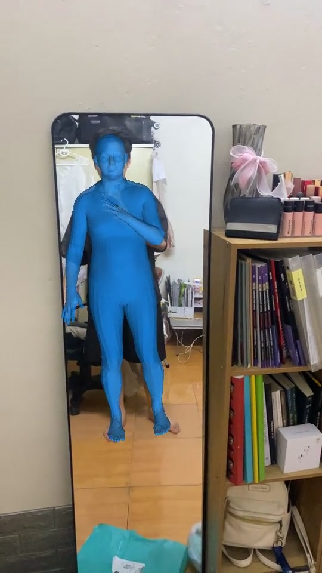

# WHAM on iPhone

World-grounded 3D human motion reconstruction, running entirely on an iPhone.

This project keeps WHAM's recurrent motion and world-trajectory model, replaces
the heavyweight visual front end with mobile-ready components, and executes the
network one frame at a time so Core ML never unrolls a whole video into memory.
The app records synchronized 30 fps video and gyroscope data, reconstructs a
full 6,890-vertex SMPL body, and presents both a camera-aligned video overlay
and an interactive 3D world view.

## Demo

<p align="center">
  <a href="./docs/assets/wham-iphone-demo.mp4">
    
  </a>
</p>

<p align="center">
  <strong><a href="./docs/assets/wham-iphone-demo.mp4">▶ Watch the 6.4-second on-device result</a></strong>
</p>

The blue body is the app's actual SMPL output over the recorded video. The
overlay uses a temporally smoothed, camera-only scale and translation fit to
confident YOLO joints. It does not deform the mesh or modify WHAM's 3D result.

## What runs on the phone

```text
30 fps camera + gyro
        │
        ▼
YOLO26m-pose ── person crop + COCO joints
        │
        ▼
HMR2.0-S ── pose + shape + 1024-D image token
        │
        ▼
residual token adapter
        │
        ▼
WHAM init once ──► WHAM image step per frame
                         │
                         ▼
              causal pose/shape smoothing
                         │
                         ▼
                  WHAM world step
                         │
                         ▼
          world joints + trajectory + SMPL mesh
```

The seven Core ML models are:

1. `yolo26m-pose`
2. `HMR2SFrontend`
3. `HMR2SSMPLInit`
4. `HMR2STokenAdapter`
5. `WHAM_I`
6. `WHAM_ImageStep`
7. `WHAM_WorldStep`

`WHAM_I` performs the true first-frame initialization. The two step models then
carry explicit recurrent and trajectory state through the video. This split is
the key deployment change: exporting WHAM as one sequence model causes Core ML
to roll out the sequence and exceed practical iPhone memory.

## Accuracy and device cost

The selected pipeline was chosen on 3DPW validation, then evaluated once on the
untouched 3DPW test population: 11 single-person tracks and 11,349 poses.

| Pipeline | PA-MPJPE ↓ | MPJPE ↓ | PVE ↓ | Acceleration error ↓ |
| --- | ---: | ---: | ---: | ---: |
| Released WHAM with official stored inputs | 32.67 mm | 55.58 mm | 65.64 mm | 6.23 m/s² |
| iPhone pipeline with light causal smoothing | **51.80 mm** | **92.06 mm** | **107.20 mm** | **10.72 m/s²** |

YOLO found a person in 99.52% of the source frames. The locked light smoother
reduced the raw mobile acceleration error by 14.43% at a cost of 0.03 mm
PA-MPJPE.

On an iPhone 11 Pro Max running iOS 18.6.2:

| Measurement | Result |
| --- | ---: |
| Warmed median latency | **187.13 ms/frame** |
| Median throughput | **5.34 fps** |
| Compiled model size | **243.8 MB** |
| Peak resident memory | **381.6 MB** |

The phone workload is a deterministic 5 × 8-frame smoke test. One extreme YOLO
stall dominated the mean, so median latency represents the typical result and
tail-latency reliability remains unresolved. See the
[full report](docs/FINAL_REPORT.md) for protocols, definitions, ablations, and
raw evidence hashes.

## Run the app

Requirements:

- Xcode 26, or a compatible Xcode that opens the checked-in project
- iOS 18.5 or newer
- a physical iPhone for meaningful Core ML and thermal measurements
- the seven generated Core ML packages listed above
- licensed SMPL face topology extracted from an HMR/HMR2 checkpoint

Place the seven `.mlpackage` directories in `WhamApp/WhamApp`. They are large,
recoverable build artifacts and are intentionally ignored by Git.

Generate the topology resource from your licensed checkpoint:

```bash
python3 tools/export/export_smpl_topology.py \
  --checkpoint /path/to/licensed_hmr_checkpoint.ckpt \
  --output WhamApp/WhamApp/SMPLFaces.bin
```

Open `WhamApp/WhamApp.xcodeproj`, select a signing team and physical iPhone,
then run a Release build. From the command line:

```bash
xcodebuild -project WhamApp/WhamApp.xcodeproj \
  -scheme WhamApp \
  -configuration Release \
  -destination 'id=YOUR_DEVICE_UDID' \
  build
```

The app has two top-level tabs:

- **AR Camera** records synchronized 30 fps video and gyro. Tap the latest
  thumbnail to open the library, analyze a recording, and inspect either the
  aligned **Video Overlay** or **3D World** result.
- **Benchmark** runs the fixed 5 × 8-frame device workload and exports
  `selected_mobile_pipeline_device_benchmark.json`.

For the intended pipeline, both **Image connected** and **Smoothing active**
must report `PASS`. Benchmark on a cool phone, disable Low Power Mode, and keep
the app foregrounded.

## Reproduce the scientific result

Rebuild the portable Kaggle notebooks:

```bash
python3 tools/kaggle/build_hmr2s_yolo26_grid_notebook.py
python3 tools/kaggle/build_hmr2s_smoothing_notebook.py
```

The [Kaggle tooling guide](tools/kaggle) records every required input, the
execution order, and the licensed-SMPL boundary. The grid selects the detector
and adapter on 3DPW validation before touching the test split. The smoothing
notebook repeats that validation-then-test discipline for the output filter.

Validate the checked-in reports, hashes, and selected configuration:

```bash
python3 tools/evaluation/validate_final_evidence.py
```

Core ML conversion entry points live in [`tools/export`](tools/export). They
convert pinned models and record numerical agreement; they do not retrain the
selected network.

## Repository map

- [`WhamApp`](WhamApp) — SwiftUI app, shared mobile pipeline, tests, and fixed
  benchmark frames
- [`evaluation/results/selected`](evaluation/results/selected) — immutable raw
  reports and SHA-256 manifest
- [`tools/export`](tools/export) — selected PyTorch-to-Core-ML exporters
- [`tools/evaluation`](tools/evaluation) — evaluation modules and evidence
  validator
- [`tools/kaggle`](tools/kaggle) — final notebook builders and generated
  notebooks
- [`docs/FINAL_REPORT.md`](docs/FINAL_REPORT.md) — complete scientific and
  device report
- [`archive/experiments`](archive/experiments) — superseded FastViT, BEDLAM,
  and early tiny-pipeline work retained for auditability

## Known limitations

- The pipeline follows the highest-confidence person; it does not maintain
  identities in multi-person scenes.
- Phone gyro is an inexpensive camera-rotation signal, not an accuracy-equivalent
  replacement for DPVO. Global trajectory accuracy still lacks synchronized
  phone ground truth.
- The video overlay corrects camera scale and translation from confident YOLO
  joints. It improves presentation alignment but is not part of the reported
  3DPW metrics and does not correct pose or depth errors.
- The fixed phone benchmark measures inference, not video decoding or SceneKit
  rendering cost.
- A Float16 `.whammesh` cache costs roughly 41 KB per frame, or 74 MB per minute
  at 30 fps.

## Attribution

WHAM is by Soyong Shin, Juyong Kim, Eni Halilaj, and Michael J. Black (CVPR
2024). Read the [paper](https://openaccess.thecvf.com/content/CVPR2024/html/Shin_WHAM_Reconstructing_World-grounded_Humans_with_Accurate_3D_Motion_CVPR_2024_paper.html)
and [official implementation](https://github.com/yohanshin/WHAM).
HMR2.0-S comes from the released
[`TruncHierVFM`](https://github.com/nttcom/TruncHierVFM) implementation. Respect
the upstream code licenses and the SMPL and 3DPW dataset terms.
