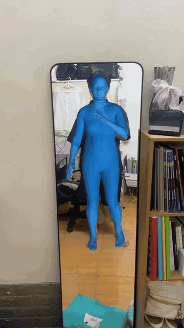

<p align="center">
  
</p>

<h1 align="center">WHAM on iPhone</h1>

<p align="center">
  <strong>World-grounded 3D human motion reconstruction, entirely on-device.</strong>
  <br>
  Record synchronized video and gyro, reconstruct a full SMPL body, and inspect it over the video or in a 3D world view.
</p>

<p align="center">
  
  
  
  
  
  
</p>

<p align="center">
  <a href="#demo">Demo</a> ·
  <a href="#measured-results">Results</a> ·
  <a href="#architecture">Architecture</a> ·
  <a href="#run-it">Run it</a> ·
  <a href="#reproduce-the-evaluation">Reproduce</a> ·
  <a href="./docs/FINAL_REPORT.md">Full report</a>
</p>

---

## Demo

<p align="center">
  <a href="./docs/assets/wham-iphone-demo.mp4">
    
  </a>
</p>

<p align="center">
  <strong>The demo plays inline.</strong><br>
  <a href="./docs/assets/wham-iphone-demo.mp4">Open the original 6.4-second MP4 with playback controls →</a>
</p>

The blue body is the app's actual 6,890-vertex SMPL output over its recorded
video—not a mockup. For presentation, the overlay applies a temporally smoothed
camera scale and 2D translation fitted to confident YOLO joints. It does not
deform the body or alter WHAM's 3D result.

## At a glance

| | |
| --- | --- |
| **Input** | 30 fps video + synchronized phone gyro |
| **Output** | World joints, trajectory, pose, shape, and 6,890 SMPL vertices |
| **Runtime** | Seven Core ML models with explicit recurrent state |
| **Viewer** | Camera-aligned video overlay + interactive 3D world |
| **Evaluation** | Untouched 3DPW test population after validation-only selection |
| **Measured device** | iPhone 11 Pro Max, iOS 18.6.2 |

## Why this exists

WHAM is recurrent. Exporting it as one sequence model invites Core ML to roll
out the entire video at once, which is not practical on an iPhone. This project
splits the network into a true one-time initializer and per-frame steps, keeps
the recurrent and trajectory states explicit, and retains an image-conditioned
front end suitable for mobile deployment.

This is the selected pipeline—not the archived FastViT fallback:

> **YOLO26m-pose → HMR2.0-S → residual token adapter → WHAM init/step → causal smoothing → SMPL/world refiner**

## Measured results

The mobile pipeline was selected on 3DPW validation and then evaluated once on
the untouched 3DPW test population: **11 single-person tracks and 11,349
poses**.

| Pipeline | PA-MPJPE ↓ | MPJPE ↓ | PVE ↓ | Acceleration error ↓ |
| --- | ---: | ---: | ---: | ---: |
| Released WHAM, official stored inputs | 32.67 mm | 55.58 mm | 65.64 mm | 6.23 m/s² |
| **Selected iPhone pipeline** | **51.80 mm** | **92.06 mm** | **107.20 mm** | **10.72 m/s²** |

YOLO found a person in **99.52%** of source frames. The locked light smoother
reduced raw mobile acceleration error by **14.43%** for only **0.03 mm** extra
PA-MPJPE.

### Device workload

| Metric | iPhone 11 Pro Max |
| --- | ---: |
| Warmed median latency | **187.13 ms/frame** |
| Median throughput | **5.34 fps** |
| Compiled model bundle | **243.8 MB** |
| Peak resident memory | **381.6 MB** |

The device workload is a deterministic **5 × 8-frame smoke test**. One extreme
YOLO stall dominated the mean, so median latency is the representative typical
number; tail reliability remains unresolved. The
[full report](docs/FINAL_REPORT.md) contains the protocols, definitions,
ablations, and raw-evidence hashes.

## Architecture

```text
30 fps camera + gyro
        │
        ▼
YOLO26m-pose ── person crop + COCO joints
        │
        ▼
HMR2.0-S ── pose + shape + 1024-D image token
        │
        ▼
residual token adapter
        │
        ▼
WHAM init once ─────► WHAM image step per frame
                              │
                              ▼
                   causal pose/shape smoothing
                              │
                              ▼
                       WHAM world step
                              │
                              ▼
               world motion + full SMPL mesh
```

<details>
<summary><strong>Seven-model Core ML bundle</strong></summary>

1. `yolo26m-pose` — person detection, crop, and COCO keypoints
2. `HMR2SFrontend` — pose, shape, camera, and 1024-D image token
3. `HMR2SSMPLInit` — real first-frame 3D joints
4. `HMR2STokenAdapter` — HMR2-S token to released WHAM token space
5. `WHAM_I` — one-time recurrent initialization
6. `WHAM_ImageStep` — per-frame recurrent image-conditioned update
7. `WHAM_WorldStep` — contact-aware world trajectory and SMPL output

</details>

`WHAM_I` receives real first-frame joints; there is no neutral or zero
initializer fallback. Light causal smoothing is output-only and never feeds a
smoothed pose back into WHAM's recurrent state.

## Run it

### Requirements

- Xcode 26, or a compatible Xcode that opens the checked-in project
- iOS 18.5 or newer
- a physical iPhone for meaningful Core ML and thermal measurements
- the seven generated Core ML packages listed above
- licensed SMPL face topology extracted from an HMR/HMR2 checkpoint

Place the seven `.mlpackage` directories in `WhamApp/WhamApp`. They are large,
recoverable build artifacts and are intentionally ignored by Git.

Generate the fixed topology resource from your licensed checkpoint:

```bash
python3 tools/export/export_smpl_topology.py \
  --checkpoint /path/to/licensed_hmr_checkpoint.ckpt \
  --output WhamApp/WhamApp/SMPLFaces.bin
```

Open `WhamApp/WhamApp.xcodeproj`, choose your signing team and physical iPhone,
then run a Release build. The command-line equivalent is:

```bash
xcodebuild -project WhamApp/WhamApp.xcodeproj \
  -scheme WhamApp \
  -configuration Release \
  -destination 'id=YOUR_DEVICE_UDID' \
  build
```

### App flow

1. Open **AR Camera** and record. The app saves 30 fps video and synchronized
   gyro samples.
2. Open the latest thumbnail and analyze the recording on-device.
3. Inspect the reconstructed body in **Video Overlay** or **3D World**.
4. Use **Benchmark** for the fixed 5 × 8-frame latency workload.

For the selected pipeline, **Image connected** and **Smoothing active** must
both report `PASS`. Benchmark on a cool phone with Low Power Mode disabled and
keep the app foregrounded.

## Reproduce the evaluation

Build the portable Kaggle notebooks:

```bash
python3 tools/kaggle/build_hmr2s_yolo26_grid_notebook.py
python3 tools/kaggle/build_hmr2s_smoothing_notebook.py
```

The [Kaggle tooling guide](tools/kaggle) records every required input, the
execution order, and the licensed-SMPL boundary. The grid selects the detector
and adapter on 3DPW validation before touching the test split. The smoothing
notebook repeats the same validation-then-test discipline for the output
filter.

Validate the checked-in reports, hashes, and selected configuration:

```bash
python3 tools/evaluation/validate_final_evidence.py
```

Core ML conversion entry points live in [`tools/export`](tools/export). They
convert pinned models and record numerical agreement; they do not retrain the
selected network.

## Repository map

| Path | Purpose |
| --- | --- |
| [`WhamApp`](WhamApp) | SwiftUI app, mobile pipeline, tests, and benchmark frames |
| [`evaluation/results/selected`](evaluation/results/selected) | Immutable reports and SHA-256 manifest |
| [`tools/export`](tools/export) | Selected PyTorch-to-Core-ML exporters |
| [`tools/evaluation`](tools/evaluation) | Evaluation modules and evidence validator |
| [`tools/kaggle`](tools/kaggle) | Final notebook builders and generated notebooks |
| [`docs/FINAL_REPORT.md`](docs/FINAL_REPORT.md) | Complete scientific and device report |
| [`archive/experiments`](archive/experiments) | Superseded FastViT, BEDLAM, and tiny-pipeline work |

## Known limitations

- The pipeline follows the highest-confidence person; it has no multi-person
  identity tracker.
- Phone gyro is an inexpensive camera-rotation signal, not an accuracy-equivalent
  replacement for DPVO. Global trajectory accuracy still lacks synchronized
  phone ground truth.
- The video overlay's YOLO-guided camera registration improves presentation but
  is not part of the reported 3DPW metrics and cannot correct pose or depth
  errors.
- The fixed phone benchmark measures inference, not video decoding or SceneKit
  rendering cost.
- A Float16 `.whammesh` cache costs roughly 41 KB per frame, or 74 MB per minute
  at 30 fps.

## Attribution

WHAM is by Soyong Shin, Juyong Kim, Eni Halilaj, and Michael J. Black (CVPR
2024). See the [paper](https://openaccess.thecvf.com/content/CVPR2024/html/Shin_WHAM_Reconstructing_World-grounded_Humans_with_Accurate_3D_Motion_CVPR_2024_paper.html)
and [official implementation](https://github.com/yohanshin/WHAM).

HMR2.0-S comes from the released
[`TruncHierVFM`](https://github.com/nttcom/TruncHierVFM) implementation. Respect
the upstream code licenses and the SMPL and 3DPW dataset terms.

---

<p align="center">
  Built as an evidence-backed mobile deployment experiment—not as a claim of parity with desktop WHAM.
</p>
